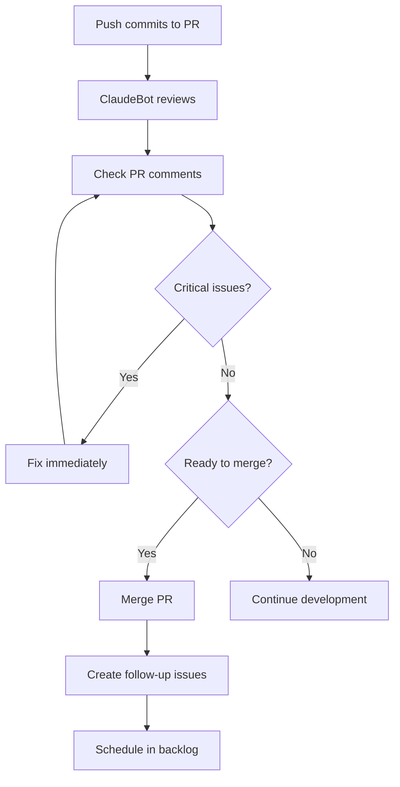

# ClaudeBot PR Feedback Review & Action Plan

**Date:** 2025-10-29
**Reviewed PRs:** #6, #7, #8
**Status:** Action items identified

## How to View ClaudeBot Comments

### Method 1: GitHub CLI (Quick)
```bash
# View all comments on a PR
gh pr view <PR_NUMBER> --comments

# View only ClaudeBot comments
gh pr view <PR_NUMBER> --json comments --jq '.comments[] | select(.author.login == "claude") | .body'

# Check all recent PRs
for pr in 6 7 8; do
  echo "=== PR #$pr ==="
  gh pr view $pr --json comments --jq '.comments[] | select(.author.login == "claude") | .body'
done
```

### Method 2: GitHub Web UI
1. Navigate to PR on GitHub
2. Look for comment from `@claude` bot
3. Review inline suggestions and general feedback

## When to Review ClaudeBot Feedback

### ✅ Best Times to Review

**1. Before Merging PR (Critical)**
- Review all ClaudeBot security concerns
- Address high-priority issues
- Create follow-up issues for medium/low priority items

**2. During Development (Proactive)**
- After pushing significant commits
- When adding new services or features
- Before requesting human review

**3. After Merge (Follow-up)**
- Create GitHub issues for deferred items
- Schedule time to address technical debt
- Track metrics on code quality improvements

### ❌ Don't Review When
- PR already merged without checking (too late, create follow-up PR)
- Still actively coding (wait until ready for review)
- During emergency hotfixes (address later)

## ClaudeBot Feedback Summary

### PR #6: BullMQ Infrastructure
**Grade:** B+ (Good foundation, minor improvements needed)
**Status:** ✅ Merged

#### High Priority Issues
1. ⚠️ **Environment variable validation missing**
   - Redis URL not validated
   - Could cause silent failures

2. ⚠️ **Security: Redis connection validation**
   - No check for redis:// vs rediss:// protocol
   - Missing AUTH verification

3. ⚠️ **Job ID collision risk**
   - Using only timestamp for uniqueness
   - Could collide in high-throughput scenarios

#### Medium Priority
4. Console.log instead of proper logging
5. Missing unit tests
6. Queue statistics could be expensive
7. Limited error handling specificity

### PR #7: Modular Services
**Grade:** ⭐⭐⭐⭐⭐ Excellent (with minor security fixes needed)
**Status:** ✅ Merged

#### High Priority Issues
1. ⚠️ **Environment variable validation** (CRITICAL)
   - R2 credentials using non-null assertion without validation
   - Could cause runtime crashes

2. ⚠️ **SQL Injection prevention**
   - Need to verify all user inputs are sanitized

3. ⚠️ **Database indexes missing**
   - No indexes on `a_number`, `sku`, `promidata_hash`
   - Will be slow with large datasets

#### Medium Priority
4. Race condition risk in concurrent Map operations
5. MD5 hash collision handling
6. Memory usage in batch operations
7. Missing unit tests

### PR #8: Orchestration Refactor
**Grade:** ✅ Outstanding (minor fixes needed)
**Status:** ⏳ Pending Review

#### High Priority Issues
1. 🐛 **Bug: Wrong ID field used**
   - Line 136: Uses `supplier.id` instead of `supplier.documentId`
   - Strapi 5 uses documentId for references

2. ⚠️ **Inconsistent API patterns**
   - Lines 245-257 use legacy Strapi 4 patterns
   - Should migrate to `strapi.documents()` API

3. ⚠️ **Incomplete error recovery**
   - Partial failures leave orphaned data
   - No transaction wrapping

#### Medium Priority
4. Unused import (hash-service)
5. No input validation on supplierId
6. No concurrency protection for simultaneous syncs
7. Hardcoded API endpoint

## Action Plan

### Immediate (Before Merging PR #8)

**Task 1: Fix supplier ID reference**
```typescript
// File: backend/src/api/promidata-sync/services/promidata-sync.ts:136
// BEFORE:
const filterResult = await productSyncService.filterProductsNeedingSync(
  productFamilies,
  supplier.id  // ❌ Wrong
);

// AFTER:
const filterResult = await productSyncService.filterProductsNeedingSync(
  productFamilies,
  Number(supplier.id)  // ✅ Ensure numeric ID
);
```

**Task 2: Migrate category import to Strapi 5 API**
```typescript
// File: backend/src/api/promidata-sync/services/promidata-sync.ts:242-257
// Replace strapi.db.query() with strapi.documents()
const existing = await strapi.documents('api::category.category').findMany({
  filters: { code: categoryData.code }
});
```

### Short-term (Next PR - Phase 2.5 Fixes)

**Task 3: Add environment variable validation**
```typescript
// File: backend/src/services/promidata/media/image-upload-service.ts
// Add validation method
private validateRequiredEnvVars() {
  const required = [
    'R2_ACCESS_KEY_ID',
    'R2_SECRET_ACCESS_KEY',
    'R2_BUCKET_NAME',
    'R2_PUBLIC_URL',
    'R2_ENDPOINT'
  ];
  const missing = required.filter(key => !process.env[key]);
  if (missing.length > 0) {
    throw new Error(`Missing required R2 environment variables: ${missing.join(', ')}`);
  }
}

// Call in constructor or initialization
constructor() {
  this.validateRequiredEnvVars();
}
```

**Task 4: Add database indexes**
```sql
-- Create migration: backend/database/migrations/add-sync-indexes.sql
CREATE INDEX idx_product_a_number ON products(a_number);
CREATE INDEX idx_product_sku ON products(sku);
CREATE INDEX idx_product_hash ON products(promidata_hash);
CREATE INDEX idx_product_supplier ON products(supplier);
CREATE INDEX idx_variant_sku ON product_variants(sku);
CREATE INDEX idx_variant_product ON product_variants(product);
```

**Task 5: Fix job ID generation**
```typescript
// File: backend/src/services/queue/queue-config.ts:142-146
import { randomUUID } from 'crypto';

export const generateJobId = (prefix: string, ...parts: (string | number)[]): string => {
  const timestamp = Date.now();
  const uuid = randomUUID().substring(0, 8);
  const partsStr = parts.join('-');
  return `${prefix}-${timestamp}-${uuid}-${partsStr}`;
};
```

**Task 6: Replace console.log with strapi.log**
```typescript
// Search and replace pattern
// BEFORE:
console.log('[ServiceName] Message');

// AFTER:
strapi.log.info('[ServiceName] Message');
strapi.log.error('[ServiceName] Error:', error);
strapi.log.warn('[ServiceName] Warning');
```

### Medium-term (Phase 3 or Phase 5)

**Task 7: Add transaction support**
```typescript
// Wrap processProductFamily in transaction
async processProductFamily(aNumber: string, variants: any[], supplier: any, productHash: string) {
  const trx = await strapi.db.transaction();
  try {
    // Create product
    const productResult = await productSyncService.createOrUpdate(productData, trx);

    // Create variants
    for (const variantData of variantDataList) {
      await variantSyncService.createOrUpdate(variantData, trx);
    }

    await trx.commit();
  } catch (error) {
    await trx.rollback();
    throw error;
  }
}
```

**Task 8: Add unit tests** (See TESTING_STRATEGY.md)
- Parsers: 90% coverage target
- Transformers: 85% coverage target
- Sync services: 75% coverage target

**Task 9: Add input validation**
```typescript
// Validate supplierId parameter
async startSync(supplierId?: string) {
  if (supplierId && !this.isValidDocumentId(supplierId)) {
    throw new Error('Invalid supplier ID format');
  }
  // ...
}

private isValidDocumentId(id: string): boolean {
  // Strapi documentId format validation
  return typeof id === 'string' && id.length > 0;
}
```

### Long-term (Future Enhancements)

**Task 10: Add monitoring and metrics**
- Track sync performance (duration, products processed)
- Monitor queue depths and processing rates
- Alert on failures and retries

**Task 11: Implement circuit breaker pattern**
- Prevent cascade failures from external API
- Add fallback mechanisms

**Task 12: Add caching layer**
- Cache frequently accessed product data
- Redis cache for API responses

## Priority Matrix

| Priority | Impact | Effort | When to Fix |
|----------|--------|--------|-------------|
| **supplier.id bug** | 🔴 High | Low | Before merge |
| **Strapi 5 API migration** | 🟡 Medium | Low | Before merge |
| **Env var validation** | 🔴 High | Low | Phase 2.5 |
| **Database indexes** | 🔴 High | Low | Phase 5 (before production) |
| **Job ID collisions** | 🟡 Medium | Low | Phase 2.5 |
| **Console.log → strapi.log** | 🟡 Medium | Medium | Phase 3 |
| **Transaction support** | 🟡 Medium | High | Phase 4 |
| **Unit tests** | 🟢 Low | High | Phase 4 |
| **Input validation** | 🟢 Low | Medium | Phase 4 |
| **Monitoring** | 🟢 Low | High | Post-launch |

## Creating Follow-up Issues

For items not fixed immediately, create GitHub issues:

```bash
# Example: Create issue for env var validation
gh issue create \
  --title "Add environment variable validation to R2 image upload service" \
  --label "technical-debt,security,priority:high" \
  --body "ClaudeBot identified missing env var validation in image-upload-service.ts.

**Issue:** Using non-null assertion without validation could cause runtime crashes.
**File:** backend/src/services/promidata/media/image-upload-service.ts:38-39
**Priority:** High (security concern)
**Effort:** Low (~30 minutes)

See: docs/CLAUDEBOT_FEEDBACK_REVIEW.md#task-3"
```

## Workflow Summary



## Metrics to Track

- **Review turnaround**: Time from PR creation to ClaudeBot review
- **Fix rate**: % of ClaudeBot issues addressed before merge
- **Security issues**: Count of security concerns identified
- **Code quality trend**: Are scores improving over time?

## Best Practices

1. ✅ **Review ClaudeBot feedback BEFORE merging**
2. ✅ **Address all HIGH priority issues before merge**
3. ✅ **Create GitHub issues for deferred items**
4. ✅ **Reference ClaudeBot feedback in commit messages**
5. ✅ **Track metrics to measure code quality improvement**
6. ✅ **Use ClaudeBot feedback for learning and improvement**

---

**Next Review:** After PR #8 is merged, review ClaudeBot feedback on Phase 3 PRs
